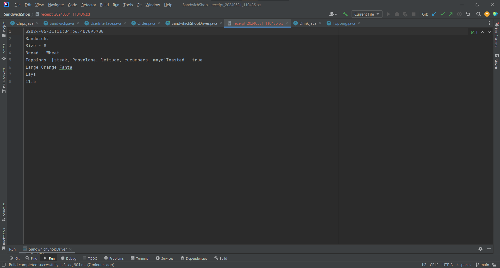
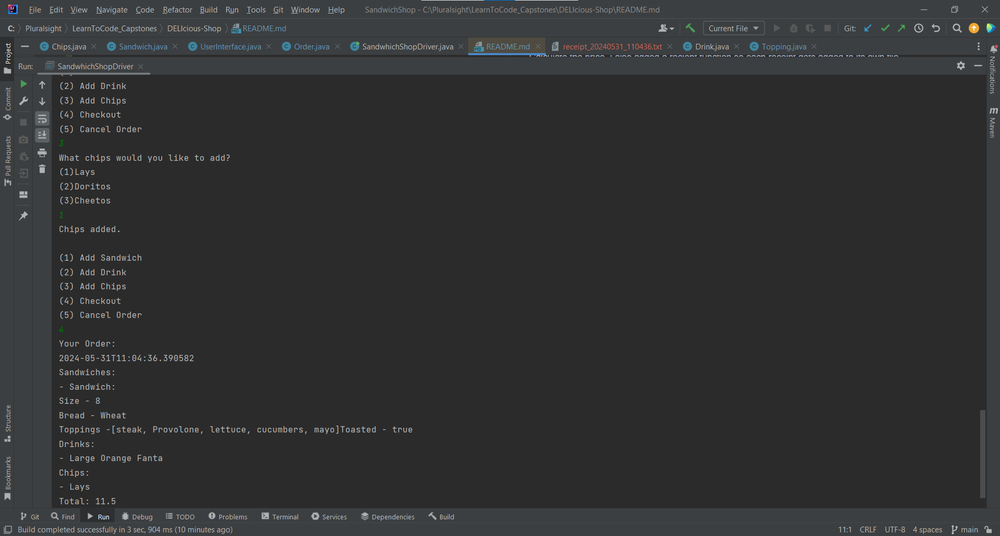
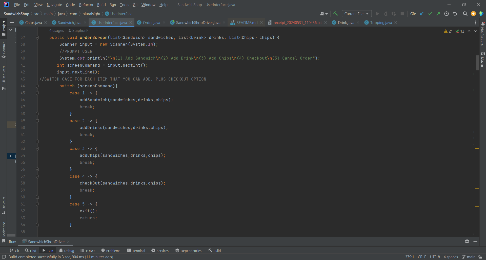
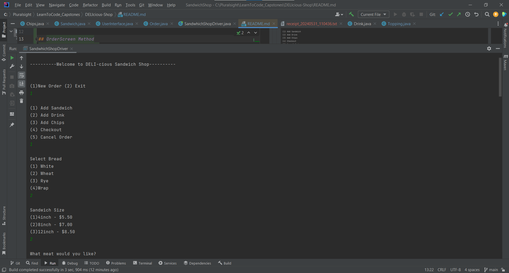
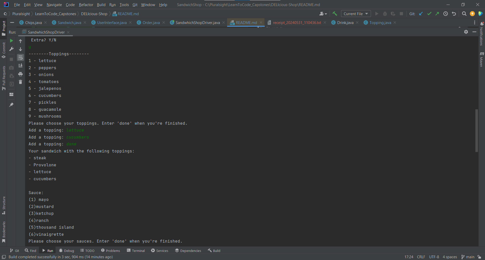

# DELIcious-Shop
In this application I created a program for a Deli Shop that
will take customers orders,Display them, and Calculate the price.
I also added a reciept function so each receipt gets added to its own file.

## Receipt file

## User Checkout Screen

## OrderScreen Method

## User orderScreen

##  User Adding Toppings
